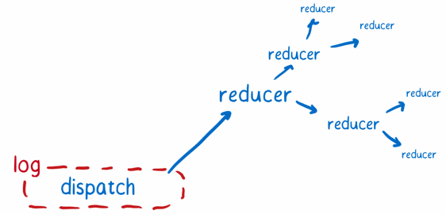

# State Management in Redux

This document will cover the basics of state management in redux. It covers the following topics:

-   Introduction to Redux.
-   Main Characters of Redux.
-   How it All ties together.

# Introduction to Redux

> Redux is a predictable state container for JavaScript applications. It helps you write applications that behave consistently, run in different environments (client, server, and native), and are easy to test.

-   In an app where data is shared among components, it might be confusing to actually know where a state should live.
-   Ideally, the data in a component should live in just one component, so sharing data among sibling components becomes difficult.
-   The way Redux works is simple. There is a central store that holds the entire state of the application.
-   Each component can access the stored state without having to send down props from one component to another.

# Main characters of Redux

#### Action Creators

<p align="center">

</p>

-   Whenever you want to change the state of the application, you shoot off an action. That’s the only way that the state should be changed.
-   Think of the action creator as a telegraph operator. You go to the action creator knowing basically what message you want to send, and then the action creator formats that in a way that the rest of the system can understand.

    ```json
    {
        "type": "LOGIN",
        "payload": {
            "username": "foo",
            "password": "bar"
        }
    }
    ```

---

### The Store

<p align="center">

</p>

-   All state changes must be made personally by a store and have to go through the action pipeline, instead of being requested directly.
-   Redux takes care of holding on to the whole state tree. It then delegates the work of figuring out what state changes need to happen. The reducers, headed up by the root reducer, take on this task.

---

### The Reducers

<p align="center">

</p>

-   When the store needs to know how an action changes the state, it asks the reducers. The root reducer takes charge and slices the state up based on the state object’s keys. It passes each slice of state to the reducer that knows how to handle it.
-   Reducers don’t want to mess anything up, so they don’t change the state that has been passed in to them. Instead, they make a copy and make all their changes on the copy.

<p align="center">

</p>

-   This is one of the key ideas of Redux. The state object isn’t manipulated directly. Instead, each slice is copied and then all of the slices are combined into a new state object.
-   The reducers pass their copies back to the root reducer, which pastes the copies together to form the updated state object. Then the root reducer sends the new state object back to the store, and the store makes it the new official state.

<p align="center">

</p>

---

### The views: smart and dumb components

<p align="center">

</p>

-   Smart components are in charge of the actions. If a dumb component underneath them needs to trigger an action, the smart component passes a function in via the props. The dumb component can then just treat that as a callback.
-   Smart components do not have their own CSS styles.
-   Smart components rarely emit DOM of their own. Instead, they arrange dumb components, which handle laying out DOM elements.
-   Dumb components don’t depend on action files directly, since all actions are passed in via props. This means that the dumb component can be reused in a different app that has different logic.

---

### The view layer binding

<p align="center">

</p>

-   To connect the store to the views, Redux needs a little help. It needs something to bind the two together. This is called the view layer binding. If you’re using React, this is react-redux.
-   The view layer binding is kind of like the IT department for the view tree. It makes sure that all of the components can connect to the store. It also takes care of a lot of technical details so that the rest of the hierarchy doesn’t have to understand them.

-   The view layer binding introduces three concepts:
    1.  The Provider component: This is wrapped around the component tree. It makes it easy for the root component’s children to hook up to the store using connect().
    2.  connect(): This is a function provided by react-redux. If a component wants to get state updates, it wraps itself using connect(). Then the connect function will set up all the wiring for it, using the selector.
    3.  selector: This is a function that you write. It specifies what parts of the state a component needs as properties.

---

### The Root Component

<p align="center">

</p>

-   All React applications have root components. This is just the component at the top level of the component hierarchy. But in Redux applications, this component takes on more responsibility.
-   The role it plays is kind of like a C-level executive. It puts all of the teams in place to tackle the work. It creates the store, telling it what reducer to use, and brings together the view layer binding and the views.
-   The root component is pretty hands-off after it initializes the app, though. It doesn’t get caught up in the day-to-day concerns of triggering rerenders. It leaves that to the components below it, assisted by the view layer binding.

# How it all ties together

## The setup

1. Get the store ready. The root component creates the store, telling it what root reducer to use, using createStore(). This root reducer already has a team of reducers which report to it. It assembled that team of reducers using combineReducers().

2. Set up the communication between the store and the components. The root component wraps its subcomponents with the provider component and makes the connection between the store and the provider.

3. The Provider creates what’s basically a network to update the components. The smart components connect to network using connect(). This ensures they’ll get state updates.

4. Prepare the action callbacks. To make it easier for dumb components to work with actions, the smart components can setup action callbacks by using bindActionCreators(). This way, they can just pass down a callback to the dumb component. The action will be automatically dispatched after it is formatted.

---

## The Data flow

Now that the application is set up, the user can start interacting with it. Let’s trigger an action to see the data flow.

<p align="center">

</p>

1. The view requests an action. The action creator formats it and returns it.
2. The action is either dispatched automatically (if bindActionCreators() was used in setup), or the view dispatches the action.
3. The store receives the action. It sends the current state tree and the action to the root reducer.
4. The root reducer cuts apart the state tree into slices. Then it passes each slice to the subreducer that knows how to deal with it.
5. The subreducer copies the slice and makes changes to the copy. It returns the copy of the slice to the root reducer.
6. Once all of the subreducers have returned their slice copies, the root reducer pastes all of them together to form the whole updated state tree, which it returns to the store. The store replaces the old state tree with the new one.
7. The store tells the view layer binding that there’s new state.
8. The view layer binding asks the store to send over the new state.
9. The view layer binding triggers a rerender.
